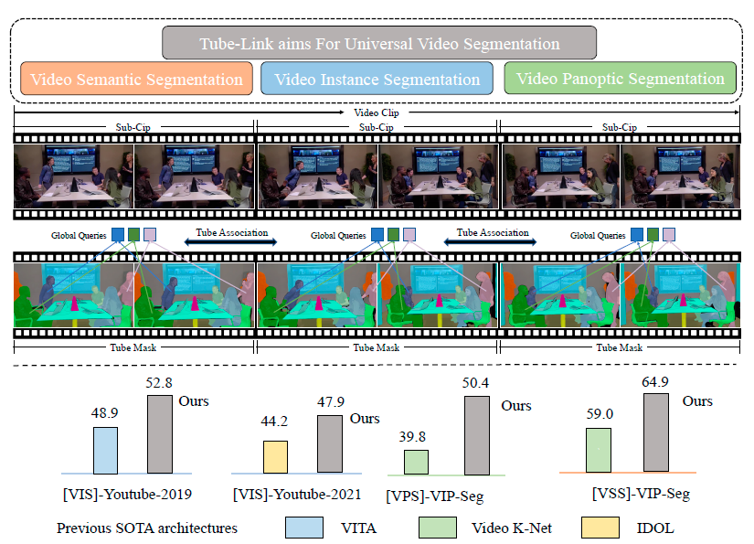

# Tube-Link: A Flexible Cross Tube Baseline for Universal Video Segmentation

Authors: [Xiangtai Li](https://lxtgh.github.io/), [Haobo Yuan](https://yuanhaobo.me/), [Wenwei Zhang](http://zhangwenwei.cn/), [Guangliang Cheng](https://sites.google.com/view/guangliangcheng), [Jiangmiao Pang](https://oceanpang.github.io/), [Chen Change Loy](https://www.mmlab-ntu.com/person/ccloy/).

**Universal Video Segmentation Model For VSS, VPS and VIS**



[[PDF]]() [[CODE]](https://github.com/lxtGH/Tube-Link)

## Visualization Results
### [VSS] VSPW
<details open>
<summary>Demo</summary>


</details>


### [VIS] Youtube-VIS 2019
<details open>
<summary>Demo</summary>

 


</details>

### [VPS] VIP-Seg


## Citation
If you think Tube-Link is useful for your research, please consider to refer Tube-Link:
```bibtex
@article{yuan2022polyphonicformer,
  title={Tube-Link: A Flexible Cross Tube Baseline for Universal Video Segmentation},
  author={Li, Xiangtai and Yuan, Haobo and Zhang, Wenwei and Cheng, Guangliang and Pang, Jiangmiao and Loy, Chen Change},
  journal={arXiv pre-print},
  year={2023},
}
```
