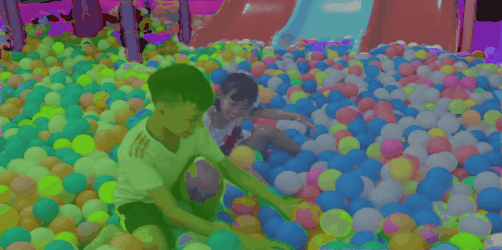

<br />
<p align="center">
  <h1 align="center">Tube-Link: A Flexible Cross Tube Baseline for Universal Video Segmentation</h1>
  <p align="center">
    Arxiv, 2023
    <br />
    <a href="https://lxtgh.github.io/"><strong>Xiangtai Li</strong></a>
    ·
    <a href="https://yuanhaobo.me/"><strong>Haobo Yuan</strong></a>
    ·
    <a href="https://zhangwenwei.cn/"><strong>Wenwei Zhang</strong></a>
    ·
    <a href="https://sites.google.com/view/guangliangcheng"><strong>Guangliang Cheng</strong></a>
    <br />
    <a href="https://oceanpang.github.io/"><strong>Jiangmiao Pang</strong></a>
    .
    <a href="https://www.mmlab-ntu.com/person/ccloy/"><strong>Chen Change Loy*</strong></a>
  </p>

  <p align="center">
    <a href='https://arxiv.org/abs/2303.12782'>
      
    </a>
    <a href='https://github.com/lxtGH/Tube-Link' style='padding-left: 0.5rem;'>
      
    </a>
  </p>
<br />

**Universal Video Segmentation Model For VSS, VPS and VIS**

[](https://paperswithcode.com/sota/video-panoptic-segmentation-on-vipseg?p=tube-link-a-flexible-cross-tube-baseline-for)

[](https://paperswithcode.com/sota/video-semantic-segmentation-on-vspw?p=tube-link-a-flexible-cross-tube-baseline-for)


[](https://paperswithcode.com/sota/video-instance-segmentation-on-youtube-vis-1?p=tube-link-a-flexible-cross-tube-baseline-for)


[](https://paperswithcode.com/sota/video-instance-segmentation-on-youtube-vis-2?p=tube-link-a-flexible-cross-tube-baseline-for)


## Highlight!!!!

**The code will be definitely released. Please stay tuned !!!!! 
We are still working to release a high quality universal video segmentation codebase using MMDetection!!!!**

## Abstract

Video segmentation aims to segment and track every pixel in diverse scenarios accurately. In this paper, we present Tube-Link, a versatile framework that addresses multiple core tasks of video segmentation with a unified architecture. Our framework is a near-online approach that takes a short subclip as input and outputs the corresponding spatial-temporal tube masks. To enhance the modeling of cross-tube relationships, we propose an effective way to perform tube-level linking via attention along the queries. In addition, we introduce temporal contrastive learning to instance-wise discriminative features for the tube-level association. Our approach offers flexibility and efficiency for both short and long video inputs, as each subclip can vary in length according to the needs of datasets or scenarios. Tube-Link outperforms existing specialized architectures by a significant margin on five video segmentation datasets. Specifically, it achieves almost 13% relative improvements on VIPSeg and 4% improvements on KITTI-STEP over the strong baseline Video K-Net. When using a ResNet50 backbone on Youtube-VIS-2019 and 2021, Tube-Link boosts IDOL by 3% and 4%, respectively.


## Features

### $\color{#2F6EBA}{Universal\ Video\ Segmentation\ Model}$ 

- A new framework unifies online video segmentation methods and near online video segmentation methods
- A new unified solution for three video segmentation tasks: VSS, VIS, and VPS.

### $\color{#2F6EBA}{Explore\ the\ Cross\-Tube\ Relation}$ 

- The first video segmentation method that explores the cross-tube relation.
- Proposed tube-wise matching performs better than frame-wise matching.

### $\color{#2F6EBA}{Strong\ Performance}$  
- Achieves strong performance on VIS, VSS, and VPS datasets (five datasets) in one unified architecture.
- AchievesEven better performance than those specific architectures.


## Visualization Results
### [VSS] VSPW
<details open>
<summary>Demo</summary>


</details>

### [VIS] Youtube-VIS 2019
<details open>
<summary>Demo</summary>

 


</details>

### [VPS] VIP-Seg

<details open>
<summary>Demo</summary>

 


</details>

### [VPS] KITTI-STEP
<details open>
<summary>Demo</summary>


</details>


## Citation
If you think Tube-Link is helpful in your research, please consider referring Tube-Link:
```bibtex
@article{li2023tube,
  title={Tube-Link: A Flexible Cross Tube Baseline for Universal Video Segmentation},
  author={Li, Xiangtai and Yuan, Haobo and Zhang, Wenwei and Cheng, Guangliang and Pang, Jiangmiao and Loy, Chen Change},
  journal={arXiv pre-print},
  year={2023},
}
```
