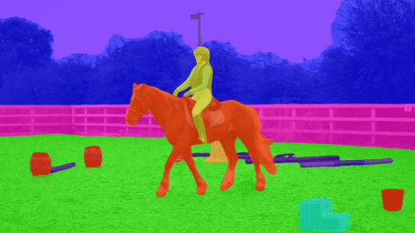

<br />
<p align="center">
  <h1 align="center">Tube-Link: A Flexible Cross Tube Baseline for Universal Video Segmentation</h1>
  <p align="center">
    Arxiv, 2023
    <br />
    <a href="https://lxtgh.github.io/"><strong>Xiangtai Li</strong></a>
    ·
    <a href="https://yuanhaobo.me/"><strong>Haobo Yuan</strong></a>
    ·
    <a href="https://zhangwenwei.cn/"><strong>Wenwei Zhang</strong></a>
    ·
    <a href="https://sites.google.com/view/guangliangcheng"><strong>Guangliang Cheng</strong></a>
    <br />
    <a href="https://oceanpang.github.io/"><strong>Jiangmiao Pang</strong></a>
    .
    <a href="https://www.mmlab-ntu.com/person/ccloy/"><strong>Chen Change Loy*</strong></a>
  </p>

  <p align="center">
    <a href=''>
      
    </a>
    <a href='' style='padding-left: 0.5rem;'>
      
    </a>
  </p>
<br />

**Universal Video Segmentation Model For VSS, VPS and VIS**

Code will be released. Please stay tuned.


[[Paper]]() [[CODE]](https://github.com/lxtGH/Tube-Link)


## Features

### $\color{#2F6EBA}{Universal Video Segmentation Model}$ 

- A new framework unifies online video segmentation methods and near online video segmentation methods
- A new unified solution for three video segmentation tasks: VSS, VIS and VPS.

### $\color{#2F6EBA}{Explore the Cross Tube Relation}$ 

- The first video segmentation method that explores the cross tube relation.
- Proposed Tube-wise matching performs better Frame-wise matching.

### $\color{#2F6EBA}{State-of-the-Art Performance}$  
- Achieves the strong performance on VIS, VSS and VPS datasets (five datasets)
- Even better performance than those specific architecture.


## Visualization Results
### [VSS] VSPW
<details open>
<summary>Demo</summary>



</details>

### [VIS] Youtube-VIS 2019
<details open>
<summary>Demo</summary>

 


</details>

### [VPS] VIP-Seg

<details open>
<summary>Demo</summary>
 


</details>

### [VPS] KITTI-STEP
<details open>
<summary>Demo</summary>


</details>


## Citation
If you think Tube-Link is useful for your research, please consider to refer Tube-Link:
```bibtex
@article{yuan2022polyphonicformer,
  title={Tube-Link: A Flexible Cross Tube Baseline for Universal Video Segmentation},
  author={Li, Xiangtai and Yuan, Haobo and Zhang, Wenwei and Cheng, Guangliang and Pang, Jiangmiao and Loy, Chen Change},
  journal={arXiv pre-print},
  year={2023},
}
```
